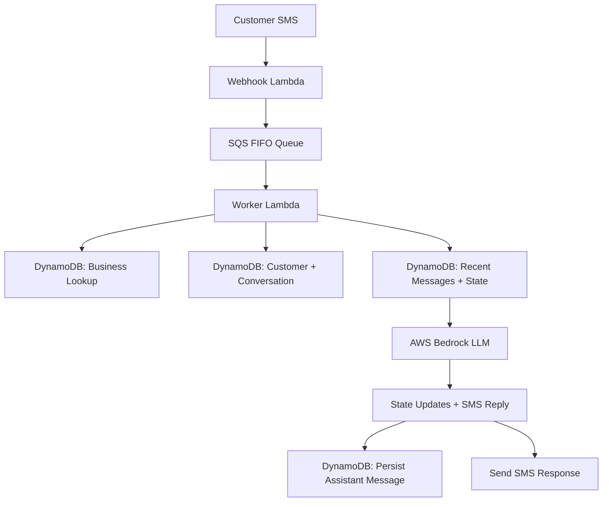

# AI SMS Receptionist

An AI-powered receptionist that lets customers text a business phone number and receive fast, natural responses for scheduling, intake, and common questions. The system is designed for small businesses that need a lightweight front desk assistant without requiring a human to answer every inbound message.

At a high level, a customer sends an SMS to a business number, the message is routed through a serverless backend, conversation history is loaded from DynamoDB, an LLM responds as the business receptionist, and the conversation state is updated so the assistant can collect the right details over multiple messages.

## What This Project Demonstrates

- Serverless backend development with AWS Lambda, SQS, DynamoDB, and Bedrock.
- Event-driven SMS processing with a webhook Lambda and asynchronous worker Lambda.
- Conversation state management for multi-turn customer interactions.
- DynamoDB single-table design for businesses, phone numbers, customers, conversations, messages, and appointments.
- LLM orchestration with structured JSON outputs for reliable state updates.
- Practical product thinking around appointment scheduling, customer intake, and business automation.
- Production-oriented concerns such as idempotent message storage, FIFO message grouping, retry-based debounce handling, and race-condition-safe record creation.

## Product Vision

This project is an AI receptionist for service businesses. A customer can text the business number and the assistant can:

- Greet the customer and respond conversationally over SMS.
- Understand whether the customer wants to schedule, ask a question, or provide more details.
- Collect scheduling details such as the issue, address, and preferred appointment time.
- Maintain context across messages so the customer does not need to repeat themselves.
- Connect to a business database or calendar to create appointments automatically.
- Answer common business questions based on the prompt and business-specific configuration.

The current implementation focuses on the backend workflow, conversation persistence, and LLM-driven receptionist behavior. Calendar/database scheduling is represented in the data model and intended integration path.

## Architecture



## Message Workflow

The core flow is documented in `temp.txt` and implemented through the webhook and worker Lambdas:

1. Incoming SMS contains `customer_phone`, `business_phone`, and `message`.
2. The system resolves which business owns the receiving phone number.
3. The customer record is fetched or created.
4. The active conversation is fetched or created.
5. The inbound message is appended to the conversation history.
6. Recent messages and conversation state are loaded.
7. The LLM receives the conversation history plus current state.
8. The LLM returns a short SMS reply and structured state updates.
9. The conversation state is merged back into DynamoDB.
10. The assistant response is saved.
11. The SMS reply is sent back to the customer.

## Conversation State

The assistant tracks structured state during the conversation so it can ask only for the next missing piece of information.

```json
{
  "intent": "repair_request",
  "problem": "leaking sink",
  "address": "123 Main St",
  "appointment_time": "Friday at 10am",
  "stage": "ready_to_book"
}
```

This design separates natural-language conversation from application state. The LLM can speak naturally to the customer while the backend keeps reliable structured data for scheduling and automation.

## DynamoDB Design

The repository includes a single-table DynamoDB schema for:

- Businesses: the organization using the receptionist.
- Phone mappings: which business owns each inbound SMS number.
- Customers: people texting the business.
- Conversations: active state for each customer/business pair.
- Messages: chronological user and assistant message history.
- Appointments: scheduled jobs or bookings.

This model supports fast lookups by business phone number, customer phone number, and conversation ID while keeping related data grouped by partition keys.

## LLM Behavior

The worker Lambda calls AWS Bedrock and instructs the model to behave like a concise SMS receptionist. Instead of returning free-form text only, the model must return JSON with:

- `reply`: the customer-facing SMS response.
- `state_updates`: structured fields to merge into the conversation.

This makes the assistant easier to integrate with real business systems because the backend can reliably detect when a conversation is ready to book, when more information is needed, or what appointment details were collected.

## Implementation Decisions

### Asynchronous Webhook Processing

The webhook Lambda does as little work as possible: it parses the incoming SMS payload, extracts the sender, receiver, and message body, then places the work onto an SQS FIFO queue. This keeps the webhook fast and resilient, which is important because SMS providers expect quick responses from webhooks.

The heavier work happens in the worker Lambda, where the system can safely perform database reads/writes, load conversation history, call the LLM, and send the response.

### FIFO Queue Grouping

Messages are grouped by the business phone and customer phone pair:

```text
business_phone#customer_phone
```

This preserves ordering for each individual conversation while still allowing different customers or businesses to be processed independently. For SMS conversations, ordering matters because "Friday at 2" only makes sense if the previous message asked for an appointment time.

### Debounce for Real SMS Behavior

People often send multiple short SMS messages in a row:

```text
Hi
I need help
My sink is leaking
Can someone come tomorrow?
```

Without debounce logic, the system might call the LLM after every single message and send fragmented replies. This project waits until the latest pending message is old enough before processing, then combines pending messages into one user turn.

That produces a more natural customer experience, reduces unnecessary LLM calls, and prevents the assistant from responding before the customer has finished typing their thought.

### Idempotent Message Storage

The worker checks whether an inbound SQS message has already been stored before appending it to the conversation. This protects against duplicate processing when queues retry messages, Lambda executions fail mid-flow, or the same event is delivered more than once.

Idempotency is especially important in messaging systems because a duplicate customer message could otherwise lead to repeated assistant replies or incorrect conversation state.

### Race-Condition-Safe Records

Customer and conversation records are created with conditional writes so two Lambda invocations do not accidentally create duplicate records for the same business/customer pair. If a race is detected, the worker fetches the existing record and continues.

This allows the system to remain reliable even when messages arrive close together or infrastructure retries overlap.

### Structured State Instead of Prompt-Only Memory

The assistant does not rely only on raw chat history. It also maintains explicit conversation state, including fields like `intent`, `problem`, `address`, `appointment_time`, and `stage`.

This makes the workflow more deterministic. The LLM can focus on deciding the next helpful response, while the backend keeps track of what information has already been collected and what still needs to happen before booking.

### Short SMS-First Responses

The system prompt intentionally tells the model to be brief, practical, and natural. SMS is not the right medium for long AI responses, so the assistant is guided to ask only for the next missing piece of information instead of overwhelming the customer.

## Repository Structure

```text
.
├── dyanmodb/
│   └── dynamodb_schema.md
├── lambda/
│   ├── webhook/
│   │   └── handler/webhook_lambda.py
│   └── worker/
│       ├── handler/worker_lambda.py
│       └── services/
│           ├── debounce.py
│           ├── dynamodb.py
│           ├── llm.py
│           └── messaging.py
├── temp.txt
└── README.md
```

## Current Status

This repo currently contains the backend foundation for the AI receptionist:

- SMS webhook parsing and queueing.
- Worker-based message processing.
- Business/customer/conversation lookup and creation.
- Conversation history persistence.
- Debounced processing for rapid multi-message SMS input.
- Bedrock-powered AI response generation.
- Structured state extraction for scheduling workflows.

The next major implementation step would be connecting the appointment-ready state to a live calendar or business database, then replacing the mock SMS sender with a production SMS provider integration.
